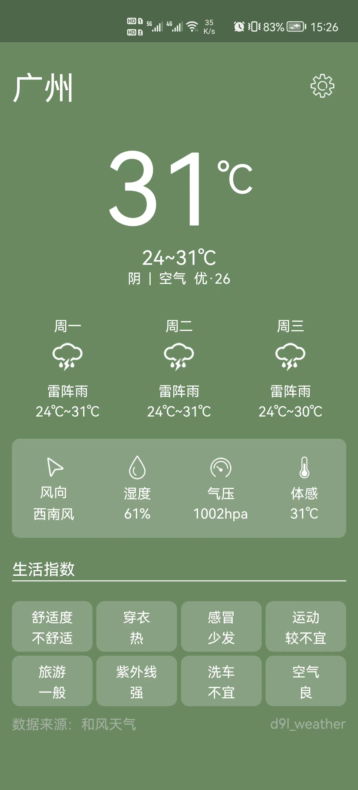
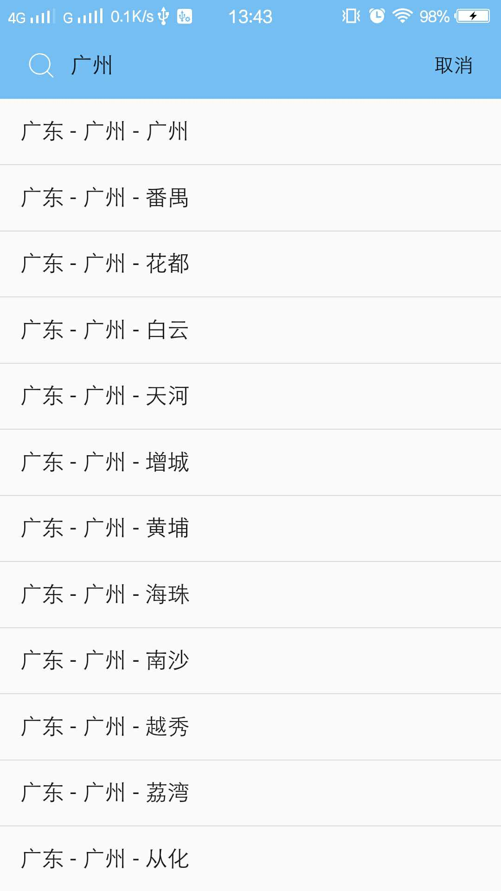

# d9l_weather

一个使用flutter编写的天气预报APP

## 效果图

## 插件
本项目使用到的插件  
shared_preferences: `0.4.3` 保存城市id  
dio: `2.1.3` 网络请求  
intl: `0.15.8` 日期格式化  
fluttertoast: `2.2.11` toast通知  

## 简书&掘金
简书[flutter天气预报APP](https://www.jianshu.com/p/e8e535952291)  
掘金[flutter天气预报APP](https://juejin.im/post/5cf75aa46fb9a07ed5248dd5)

## License
this repo is [GPL-3.0](https://github.com/huang-weilong/d9l_weather/blob/master/LICENSE) licensed.
